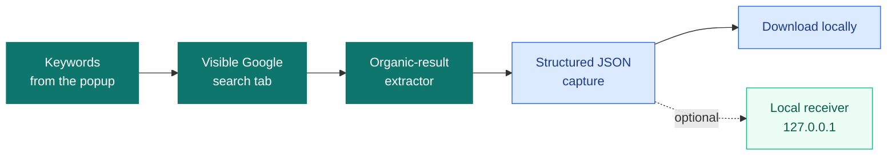

<p align="center">
  
</p>

<p align="center">
  <a href="https://github.com/pablovivero/extension-seo/blob/main/LICENSE"></a>
  
  
  
</p>

<p align="center">
  <a href="#install">Install</a> &bull; <a href="#how-it-works">How it works</a> &bull; <a href="#stack">Stack</a> &bull; <a href="#optional-local-receiver">Local receiver</a>
</p>

> A Chrome extension for capturing the organic Google results you can already see, turning them into structured JSON, and keeping the whole workflow under your control.

# SERP Capture Extension

SERP Capture is a Chrome Manifest V3 extension that captures visible organic Google Search results for a list of keywords and exports a structured JSON file.

It is designed for local, user-controlled SEO workflows: the extension opens Google in a visible browser tab, reads the loaded results page, and stores the capture locally. It does not use a remote backend, scraping proxy, analytics service, or third-party scraping API.

## How It Works



The extension processes one keyword at a time in a temporary, visible Google tab. It captures valid organic results, assigns consecutive positions, exports the data, and then closes the tab.

## Stack

<p>
  
  
  
  
</p>

## Features

- Capture organic results visible on Google Search result pages.
- Export captures as JSON.
- Keep the latest capture temporarily available for another download.
- Optionally send captures to a local receiver through a simple authenticated local HTTP API.
- Poll a local receiver for pending capture jobs with Chrome alarms.
- Detect common consent, CAPTCHA, unusual-traffic, no-result, and error states without trying to bypass them.

## Limitations

- Captures only visible organic results with an HTTP/HTTPS link and visible title.
- Does not capture ads, AI Overview, People Also Ask, featured snippets, videos, local packs, or paginated results.
- Does not scrape destination pages.
- Does not accept consent screens, solve CAPTCHA, or evade Google protections.
- Google changes its DOM often, so selectors and heuristics may need maintenance.

## Install

```bash
npm install
```

## Build And Test

```bash
npm run typecheck
npm test
npm run build
```

The compiled extension is generated in `dist`.

## Load In Chrome

1. Open `chrome://extensions`.
2. Enable Developer mode.
3. Choose `Load unpacked`.
4. Select the generated `dist` directory.
5. Open the `SERP Capture` popup.

## Basic Usage

1. Enter one keyword per line.
2. Choose a result count per keyword, from 1 to 10.
3. Click `Start capture`.
4. The extension opens a temporary Google tab and processes one keyword at a time.
5. When the run finishes, it downloads `serp-results-<timestamp>.json`.
6. While the service worker keeps the result in `chrome.storage.session`, it can be downloaded again from the popup.

## Optional Local Receiver

The extension can send the same capture JSON to a local HTTP receiver. This is useful when pairing the browser extension with a local CLI or desktop workflow.

By default the extension uses:

- `GET http://127.0.0.1:43187/job` to ask for a pending capture job.
- `POST http://127.0.0.1:43187/serp` to send the completed capture.

The local receiver is expected to use a bearer token shared through a pairing code. The extension stores that pairing code in `chrome.storage.local` on the user's machine.

### Configure The Endpoint

The default local API origin can be changed at build time:

```bash
VITE_LOCAL_CAPTURE_ENDPOINT=http://127.0.0.1:43187 npm run build
```

Only local hosts are declared in the extension manifest:

- `http://127.0.0.1/*`
- `http://localhost/*`

### Local API Contract

Pending job response:

```json
{
  "keywords": ["technical seo checklist", "best ergonomic keyboard"],
  "requestedResultCount": 5
}
```

When there is no pending job, the receiver should return `204 No Content`.

Capture submission:

```http
POST /serp
Authorization: Bearer <pairing-code>
Content-Type: application/json
```

The receiver should return `204 No Content` when it accepts the capture and `401 Unauthorized` when the pairing code is invalid.

## Capture JSON Contract

```ts
interface SerpCapture {
  schemaVersion: "1.0";
  capturedAt: string;
  engine: "google";
  locale: string;
  queries: SerpQuery[];
}

interface SerpQuery {
  keyword: string;
  searchUrl: string;
  capturedAt: string;
  requestedResultCount: number;
  results: SerpResult[];
  warnings: string[];
}

interface SerpResult {
  position: number;
  title: string;
  url: string;
  domain: string;
  snippet: string | null;
  type: "organic";
}
```

## Capture Strategy

The content script analyzes the DOM already loaded in Google. It looks for common result containers such as `div.g`, `div.MjjYud`, and related containers, requires a visible `h3` inside a link, normalizes URLs, calculates the domain with `new URL`, and assigns consecutive positions only to valid organic results.

It also includes a fallback path based on visible `h3` headings when the common containers are not present.

## Excluded Blocks

- Ads or blocks marked as sponsored.
- Google internal URLs such as search, preferences, cache, tools, maps, shopping, and internal redirects without a valid destination.
- Non-HTTP/HTTPS links.
- Duplicate URLs within the same keyword.
- Blocks without a visible title or valid URL.

## Security And Privacy Notes

- Captured keywords and SERP results may contain sensitive business research. Treat exported JSON files accordingly.
- Pairing codes are stored locally in Chrome extension storage; they are never committed to the repository.
- No remote telemetry or analytics is included.
- See [SECURITY.md](SECURITY.md) for vulnerability reporting.

## Maintenance

This project is maintained by its owner. The source is public for installation, inspection, and personal use.

## License

MIT
